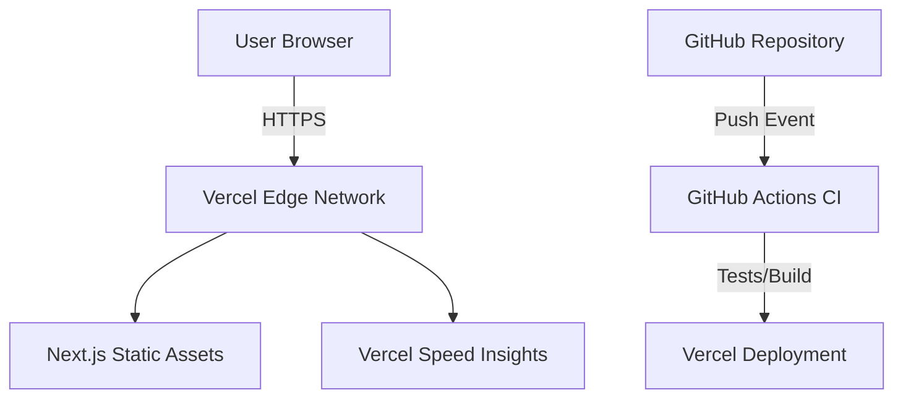

# AgriMonitorPH System Architecture

AgriMonitorPH is a cloud-native static web application designed for high performance and zero-cost scalability.

## Components
- **Frontend** Next.js (App Router) for optimized static rendering.
- **Validation** Zod for runtime type safety and input sanitization.
- **Infrastructure** Vercel for global content delivery (Edge).
- **Automation** GitHub Actions for continuous integration.