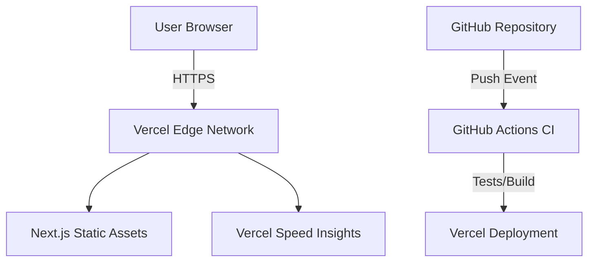

# AgriMonitorPH System Architecture

AgriMonitorPH is a cloud-native static web application designed for high performance and zero-cost scalability.

## Components
- **Frontend** Next.js (App Router) for optimized static rendering.
- **Validation** Zod for runtime type safety and input sanitization.
- **Infrastructure** Vercel for global content delivery (Edge).
- **Automation** GitHub Actions for continuous integration.

#### **File 2: `docs/devops-practices.md`**

# DevOps Practices & Automation

1. **Automation:** Fully automated CI/CD pipeline ensures code is tested and deployed on every push to `main`.
2. **Collaboration:** Used a GitFlow-inspired branching strategy (`feature/*` → `dev` → `main`) with peer-review ready PR templates.
3. **Monitoring:** Integrated Vercel Analytics and custom `logger.ts` to track FCP and user events.
4. **Cloud Improvement:** **Pipeline Optimization.** Implemented `pnpm` caching and "Source Upload" deployment to reduce build time from 2 mins to < 45 seconds.